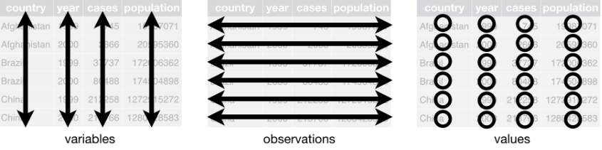
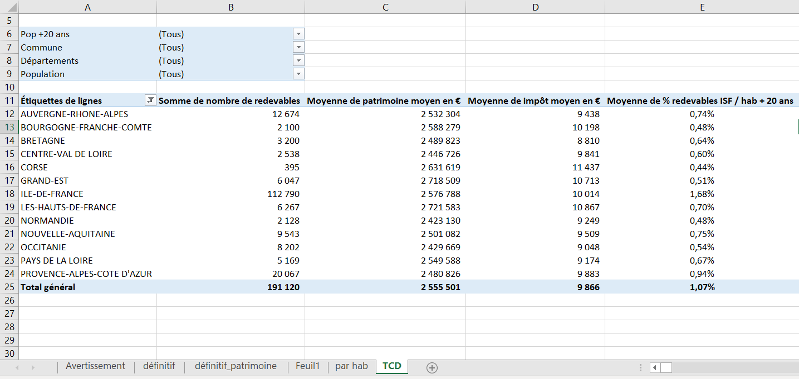
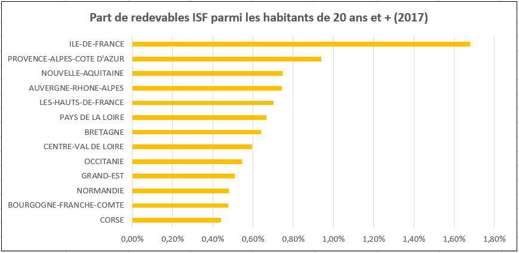
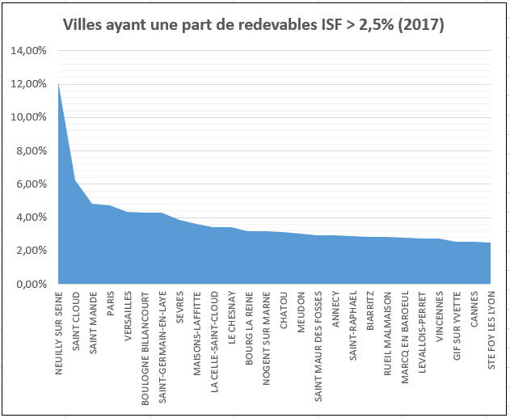

layout: true

`r paste0("
", params$event, " 

")`

---
## Before we start

 

Slides : `r paste0("https://gidoin.github.io/sciencespodata/", params$slug)`

Sources : `r paste0("https://github.com/Gidoin/sciencespodata/")`

This production is freely reusable under the terms of the licence  [Creative Commons 4.0 BY-SA](https://creativecommons.org/licenses/by-sa/4.0/legalcode.fr).

.center[*The content of this presentation is partly inspired by other presentations made by Datactivist team. I warmly thank them and notably [Joël Gombin](https://twitter.com/joelgombin) for his help.*]

 

.center[] 

---
## Before we start: reminder

.center[]

---
## Before we start: reminder

- **Midterm Exam** : 
  - **25% of your total grade** 
  - By group of .red[2 students] 
  - Data manipulation, analysis visualisation exercise based on open data
  - Instructions will be given end of next workshop (03/10)
  - To be submitted before .red[25/10] 11:59 pm

- **Final Exam** : 
  - **75% of your total grade**
  - By group of .red[4 students]
  - 10-pages paper on the analysis of 3 uses cases (outside France) in one of the following topics: social benefits, police / justice, education, public sector human
resources
  - 1 oral presentation (15 min) during the last session 
  - 1 Medium blog post (1,5 pages) to present your findings
  - Evaluation of final exam: 50% quality of the analysis, 25% oral presentation, 25%
quality of Medium blogpost

---
## Before we start: Final exam

5 topics :

- **Social action / social benefits** (unemployment, housing, family benefits, …)

- **Police, justice, law enforcement**

- **Education** (schools, universities, …)

- **Public sector human resources management** (recruitment, professional mobility, career management, liabilities and discipline of employees)

- **Health**

1 group per topic, 5 students per group (25 students)

But some parameters to take into account : personal preferences, master speciality, subject difficulty + request to have at least 1 French and foreign student in each group

---
## Before we start: Final exam

Few options, let's chose the algorithms together :

1/ We constitute the groups randomly and assign them randomly to topics

--

2/ You constitute the group and we assign you randomly to topics

--

3/ You decide by yourself the group constitution and the topic

--

but what if more than one group per topic ? 

First come first served basis ?

Random assignation next course ?

=> **Groups have to be constituted and assigned with one topic on 03/10 at latest**

---
## Let's go back to open data

.center[]

--

**What are the 2 main challenges regarding Open Data ?**

---
class: inverse, center, middle
# Challenge 2 : data quality

---
## Challenge 2 : data quality

> **Government data is usually incomplete, out of date, of low quality, and fragmented.** In most cases, open data catalogues or portals are manually fed as the result of informal data management approaches. **Procedures, timelines, and responsibilities are frequently unclear among government institutions tasked with this work.**

OpenDataBarometer ?

> It's a global measure of how governments are publishing and using open data for accountability, innovation and social impact. The Leaders Edition looks at the 30 governments that have adopted the Open Data Charter and those that, as G20 members, have committed to G20 Anti-Corruption Open Data Principles.

.footnote[http://opendatabarometer.org/4thedition/report/]

---
## Challenge 2 : data quality

---
## Challenge 2 : data quality

.footnote[[OpenDataBarometer 2017 ranking](https://opendatabarometer.org/?_year=2017&indicator=ODB)]

---
## Challenge 2 : data quality

Sometimes data are well too agregated...

---
## Challenge 2 : data quality

Or hardly exploitable...

.center[] 

.footnote[[Source](https://medium.com/datactivist/qui-a-ouvert-quoi-le-recensement-des-donn%C3%A9es-des-villes-est-maintenant-ouvert-b7f697135c1f)]

---
## Challenge 2 : data quality

Or hardly exploitable...²

.center[] 

.footnote[[Source](https://medium.com/datactivist/qui-a-ouvert-quoi-le-recensement-des-donn%C3%A9es-des-villes-est-maintenant-ouvert-b7f697135c1f)]

---
## Challenge 2 : data quality

.center[] 

[Download Open Refine (+ tutorials)](http://openrefine.org/)

---
## Challenge 2 : data quality

.center[] 

[Have a look to CSV GG (an Etalab initiative)](https://csv-gg.etalab.studio/)

---
## Tidy data

.center[] 

--

[_Tidy data_ Paradigm](http://vita.had.co.nz/papers/tidy-data.pdf) (Hadley Wickham)

> “All happy families are alike, but every unhappy family is unhappy in its own way” – Leon Tolstoï 

> “Tidy datasets are all alike, but every messy dataset is messy in its own way.” – Hadley Wickham

---
## Tidy data

[*Tidy data principles*](https://garrettgman.github.io/tidying/) ("données ordonnées")
- Each variable in the data set is placed in its own column
- Each observation is placed in its own row
- Each value is placed in its own cell

.center[] 

+ Each type of unit observed is placed in its own table

---
class: inverse, center, middle
# Manipulating (Open) Data

---
## Le pipeline de données

According to you, what are the steps while manipulating data ?

--

---
## Data manipulation through spreadsheet : filter & sort

Form a group of 2-3 students (please 1 French per group)

- Find and download the dataset with the number of ISF licence payer in 2017

- What is the difference between the tabs *définitif* and *définitif_patrimoine* ?

--
 
- Sort data from tab *définitif_patrimoine* so as to be ordered exactly in the same way as those from tab *définitif*

--

- In column h, compute the total ISF paid *per city*

- Which cities paid the most ISF in 2017 ? (in absolute terms)

--

- Which cities from "Ile de France" region paid the most ISF in 2017 ? (in absolute terms)

- Which Parisian departments/districts paid the most ISF in 2017 ? (in absolute terms)

---
## Data manipulation through spreadsheet : functions

- What is the total amount of ISF given by those cities ?
 

--

Use the function *sommeprod* / *sumproduct*

=> .red[2 535 350 477]

--

- Let's pretend that the average ISF paid by Levallois-Perret inhabitants is representative of the average ISF paid by the French licence payers.

- Compute the hypothetic total amount of ISF that it would generate in this scenario. Would the French government be more profitable in that scenario ?

--

Block cells with **$**

--

- If you want to visualise at a glance the difference of property/estate, use the **conditionnal formating**

---
## Data manipulation through spreadsheet : functions

.center[]

---
## Data manipulation through spreadsheet : functions

- You would like to get the number of ISF licence payers in "Ille et Vilaine" department but without filering nor sorting...

--

Function *somme.si* / *sum.if*

.red[1 836]

--

- You would like to get the number of ISF licence payers in Paris but only in districts where the average ISF paid is above 10 000€ (and still without filtering nor sorting)
--

Function *somme.si.ens* / *sumifs*

.red[60 176]

---
## Data manipulation through spreadsheet : functions

- Same constraints (no filtering/sorting) - but now we want to know the number of cities in Ille et Vilaine that have ISF taxpayers 

--

Function *nb.si* / *count.if*

.red[3]

--

- And how many Parisian districts whose average ISF is above 10 000€ are there ?

--

Function *nb.si.ens* / *count.ifs*

.red[17]

---
class:center, middle, inverse
## Coffee break : 5 minutes \o/

---
## Data manipulation through spreadsheet : Vlookup

- ISF data are interesting but there is one key variable missing...

-- 

**population** !

- Find and download a dataset enabling you to get demographic data given city per city 

- Look at its structure and select the variables / columns that you want

- Open a now tab in your ISF spreadsheet, copy/paste the columns from your tab "patrimoine" and add a new column where you will collect the number of inhabitants associated to each city that have ISF taxpayers. For this, you need to use the function *rechercheV* / *Vlookup*

---
## Data manipulation through spreadsheet : Vlookup

.center[]

---
## Data manipulation through spreadsheet : Vlookup

- Interesting, but not sufficient to compare the ISF paid per inhabitants, why ?

--

- Now you want to create a new column with only the number of adult inhabitants (>= 18) per city

--

- Now you can get the ratio of number of adult inhabitants that were ISF licence payers 

+ What are the cities with the highest proportion of adult ISF payers ?

+ How many cities of more than 20 000 inhabitant don't have at least 50 ISF payers ?

+ What is the biggest French city that don't have at least 50 ISF payers ?
Quelle est la plus grande ville française qui n'a pas au moins 50 redevables ISF ?

---
## Data manipulation through spreadsheet : pivot table

- Open a new tab

- Insert a *pivot table* / *tableau croisé dynamique* based on the scope of the data where you have all your previous columns

- Insert in your pivot each variable and split them this way :
+ Filters : Pop+20y / Cities / Departments / Pop
+ Lines : Region
+ Value : Sum of number of ISF taxpayers / Average Property / Average ISF paid / % of adult ISF taxpayer

- Filter by removing Guyane, Guadeloupe, Réunion, Martinique

---
## Data manipulation through spreadsheet : pivot table

You should get the following pivot table :

.center[]

---
## Data manipulation through spreadsheet : pivot table

And the following pivot graph :

.center[]

---
## Data manipulation through spreadsheet : pivot table

You can create as many graphs as you want, so amazing !

.center[]

---
## See you next week !

So happyyyyy togetheeeeer !

.center[]

---
class: inverse, center, middle

# Thank you !

Contact : [timothee.gidoin@sciencespo.fr](mailto:timothee.gidoin@sciencespo.fr)
