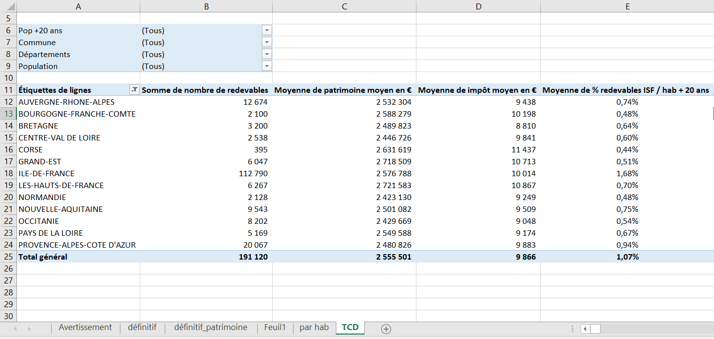
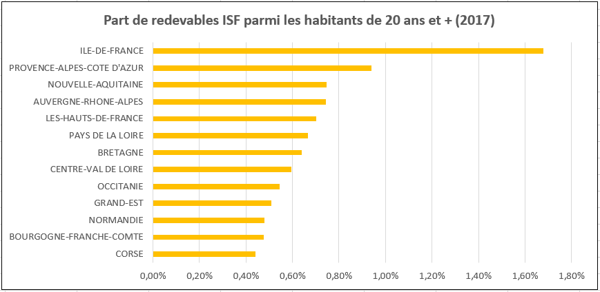
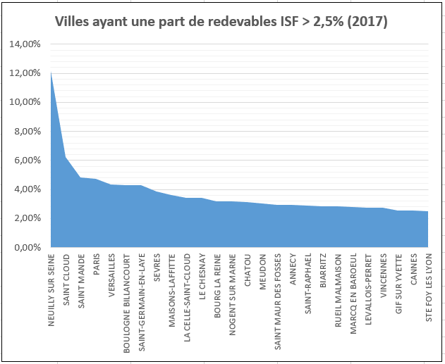

layout: true

`r paste0("
", params$event, " 

")`

---
## Before we start

 

Slides : `r paste0("https://gidoin.github.io/sciencespodata/", params$slug)`

Sources : `r paste0("https://github.com/Gidoin/sciencespodata/")`

This production is freely reusable under the terms of the licence  [Creative Commons 4.0 BY-SA](https://creativecommons.org/licenses/by-sa/4.0/legalcode.fr).

.center[*The content of this presentation is partly inspired by other presentations made by Datactivist team. I warmly thank them and notably [Joël Gombin](https://twitter.com/joelgombin) for his help.*]

 

.center[] 

---
## Before we start: reminder

.center[]

---
## Before we start: reminder

- **Midterm Exam** : 
  - **25% of your total grade** 
  - By group of .red[2 students] 
  - Data manipulation, analysis visualisation exercise based on open data
  - Instructions will be given end of next workshop (03/10)
  - To be submitted before .red[25/10] 11:59 pm

- **Final Exam** : 
  - **75% of your total grade**
  - By group of .red[4 students]
  - 10-pages paper on the analysis of 3 uses cases (outside France) in one of the following topics: social benefits, police / justice, education, public sector human
resources
  - 1 oral presentation (15 min) during the last session 
  - 1 Medium blog post (1,5 pages) to present your findings
  - Evaluation of final exam: 50% quality of the analysis, 25% oral presentation, 25%
quality of Medium blogpost

---
## Before we start: Final exam

5 topics :

- **Social action / social benefits** (unemployment, housing, family benefits, …)

- **Police, justice, law enforcement**

- **Education** (schools, universities, …)

- **Public sector human resources management** (recruitment, professional mobility, career management, liabilities and discipline of employees)

- **Health**

1 group per topic, 5 students per group (25 students)

But some parameters to take into account : personal preferences, master speciality, subject difficulty + request to have at least 1 French and foreign student in each group

---
## Before we start: Final exam

Few options, let's chose the algorithms together :

1/ We constitute the groups randomly and assign them randomly to topics

--

2/ You constitute the group and we assign you randomly to topics

--

3/ You decide by yourself the group constitution and the topic

--

but what if more than one group per topic ? 

First come first served basis ?

Random assignation next course ?

=> **Groups have to be constituted and assigned with one topic on 03/10 at latest**

---
## Let's go back to data

.center[]

---
## Data manipulation through spreadsheet : Vlookup

- ISF data are interesting but there is one key variable missing...

-- 

**population** !

- Find and download a dataset enabling you to get demographic data given city per city 

- Look at its structure and select the variables / columns that you want

- Open a now tab in your ISF spreadsheet, copy/paste the columns from your tab "patrimoine" and add a new column where you will collect the number of inhabitants associated to each city that have ISF taxpayers. For this, you need to use the function *rechercheV* / *Vlookup*

---
## Data manipulation through spreadsheet : Vlookup

.center[]

---
## Data manipulation through spreadsheet : Vlookup

- Interesting, but not sufficient to compare the ISF paid per inhabitants, why ?

--

- Now you want to create a new column with only the number of adult inhabitants (>= 18) per city

--

- Now you can get the ratio of number of adult inhabitants that were ISF licence payers 

+ What are the cities with the highest proportion of adult ISF payers ?

+ How many cities of more than 20 000 inhabitant don't have at least 50 ISF payers ?

+ What is the biggest French city that don't have at least 50 ISF payers ?
Quelle est la plus grande ville française qui n'a pas au moins 50 redevables ISF ?

---
## Data manipulation through spreadsheet : pivot table

- Open a new tab

- Insert a *pivot table* / *tableau croisé dynamique* based on the scope of the data where you have all your previous columns

- Insert in your pivot each variable and split them this way :
+ Filters : Pop+20y / Cities / Departments / Pop
+ Lines : Region
+ Value : Sum of number of ISF taxpayers / Average Property / Average ISF paid / % of adult ISF taxpayer

- Filter by removing Guyane, Guadeloupe, Réunion, Martinique

---
## Data manipulation through spreadsheet : pivot table

You should get the following pivot table :

.center[]

---
## Data manipulation through spreadsheet : pivot table

And the following pivot graph :

.center[]

---
## Data manipulation through spreadsheet : pivot table

You can create as many graphs as you want, so amazing !

.center[]

---
class:center, middle, inverse
## Coffee break : 5 minutes \o/

---
## See you next week !

So happyyyyy togetheeeeer !

.center[]

---
class: inverse, center, middle

# Thank you !

Contact : [timothee.gidoin@sciencespo.fr](mailto:timothee.gidoin@sciencespo.fr)
